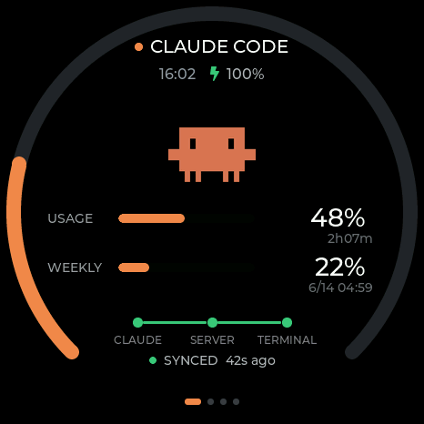
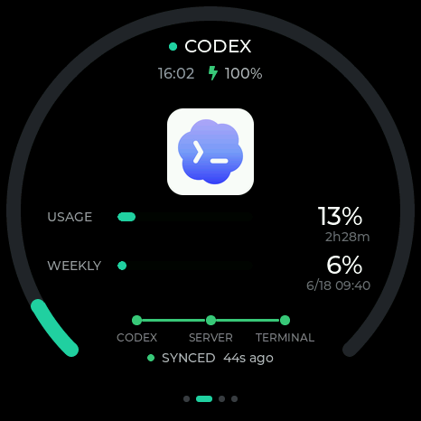
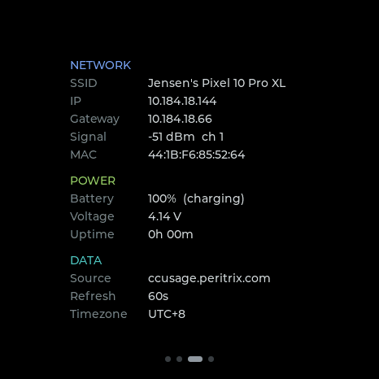
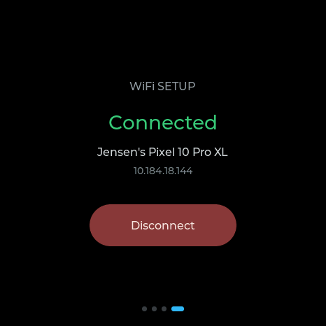

# TokenGenie

A desk display that shows your **Claude Code** and **Codex** usage limits on a
**Waveshare ESP32-S3-Touch-AMOLED-1.75** (466×466 round AMOLED).

It reads the **official** 5-hour and 7-day usage limits straight from the same
OAuth endpoints the CLIs use — not local log estimates — so the percentages and
reset countdowns match what you see in the apps.

<p align="center">
  
  
</p>
<p align="center">
  
  
</p>
<p align="center"><sub>Claude · Codex · Info (diagnostics) · WiFi setup — swipe left/right between pages</sub></p>

---

## How it works

```
host machine (Linux/macOS)                 Cloudflare              ESP32-S3 round AMOLED
┌──────────────────────────────┐                                 ┌────────────────────────┐
│ usage_server.py  :8787       │   outbound   ┌───────────┐      │ firmware (LVGL)         │
│  └ reads local OAuth tokens  │──http2 tunnel│  CF edge  │      │  page 1: Claude         │
│    ~/.claude, ~/.codex       │              │           │      │  page 2: Codex          │
│  └ calls official usage APIs │              └─────┬─────┘      │  page 3: Info / diag    │
│  └ serves compact JSON       │                    │           │  page 4: WiFi setup     │
│ cloudflared (connector)      │       https://<your-host>/usage │  polls + renders        │
└──────────────────────────────┘                    └──HTTPS────►└────────────────────────┘
```

The ESP32 can't read your usage itself. A small host bridge reads the OAuth
access tokens that the Claude Code / Codex CLIs already keep on disk, queries
the official usage endpoints, and serves a compact JSON snapshot. A Cloudflare
tunnel (or any HTTPS reverse proxy / port-forward) exposes it so the watch can
reach it from any network.

> The bridge only reads **your own** usage with **your own** tokens, the same
> way the CLIs do. Tokens are re-read from disk each refresh, so when the CLIs
> rotate their tokens the bridge picks up the new ones automatically.

---

## Repo layout

```
firmware/token-meter/   PlatformIO project (the firmware)
firmware/FIRMWARE.md    firmware build/architecture notes
host/usage_server.py    Python host bridge (stdlib only)
host/cf_tunnel_setup.py optional: provision a Cloudflare named tunnel via API
host/config.json        runtime config (gitignored — copy from .example)
firmware/waveshare-ref/  vendored Waveshare libs (gitignored — see Build)
```

---

## Host bridge

```bash
cd host
cp config.json.example config.json     # set a long random auth_key
python3 usage_server.py
```

- Reads the Claude bearer from `~/.claude/.credentials.json` and the Codex
  bearer + account id from `~/.codex/auth.json`.
- Serves `GET /usage?key=<auth_key>` → compact JSON; `GET /healthz` (no auth).
- Wrong/missing `key` → `401`. If an endpoint returns 401 the last good
  snapshot is kept.

### `/usage` response shape

```json
{
  "updated": 1781063381,
  "claude": {
    "five_hour": { "util": 42, "reset_at": 1781070000 },
    "seven_day": { "util": 17, "reset_at": 1781600000 }
  },
  "codex": {
    "five_hour": { "util": 8,  "reset_at": 1781069000 },
    "seven_day": { "util": 31, "reset_at": 1781590000 }
  },
  "ok": true
}
```

- `util` = percent used (0–100). `reset_at` = unix epoch when that window resets.
- The watch renders 5h as a countdown; 7d as a clock time (or countdown if < 24h).

### Exposing it

Any HTTPS path to `:8787` works (reverse proxy, port-forward, Tailscale, …).
`cf_tunnel_setup.py` provisions a Cloudflare named tunnel entirely via the CF
API — set `CF_ACCOUNT_ID` / `CF_ZONE_ID` / `CF_ZONE_NAME` and put a CF API token
at `~/.cloudflared/api_token`. The watch only ever makes outbound HTTPS, so this
works even behind client-isolated/CGNAT networks.

---

## Firmware

Board: **Waveshare ESP32-S3-Touch-AMOLED-1.75**

| | |
|---|---|
| Screen | 1.75" **round** AMOLED, 466×466, CO5300 (QSPI) |
| Touch | CST9217 (I2C) |
| MCU | ESP32-S3R8, 8 MB PSRAM, 16 MB flash, WiFi + BLE5 |
| Extras | AXP2101 PMU, PCF85063 RTC, TCA9554 expander, QMI8658 IMU |

Pin map (`firmware/token-meter/include/pin_config.h`):

```
CO5300 display, QSPI:  D0=4 D1=5 D2=6 D3=7  SCLK=38 CS=12 RESET=39   466×466
CST9217 touch, I2C:    SDA=15 SCL=14 INT=11 RESET=40
Shared I2C:            touch 0x5A · AXP2101 PMU 0x34 · PCF85063 RTC 0x51
```

### Features

- **4 pages**: Claude · Codex · Info (network/power/system diagnostics) · WiFi setup.
- Dual concentric arcs, 5h + 7d usage bars, reset countdowns, sync-status card.
- **Navigation**: swipe left/right (or single-click the PWR key) to change page;
  swipe up/down to scroll the Info page.
- **Battery** percentage + charging bolt (green charging / red low / grey normal),
  RTC clock with NTP sync and auto-DST timezones.
- **Trilingual** UI — short-press BOOT cycles English / 中文 / Deutsch.
- **WiFi setup** lives on page 4: shows connection status with a Connect/Disconnect
  toggle; "Start Setup" opens a captive portal (`TokenGenie-Setup` AP) — tap the
  screen to cancel.

### Build & flash (PlatformIO)

```bash
cd firmware/token-meter
cp include/secrets.h.example include/secrets.h   # fill in WiFi + METER_URL/KEY
pio run -t upload
```

Uses the [pioarduino](https://github.com/pioarduino/platform-espressif32)
platform fork (arduino-esp32 3.x) — the stock `espressif32` only ships 2.x,
which the vendored CO5300 GFX fork isn't built against.

**Vendored libraries** (`firmware/waveshare-ref/`, ~340 MB) are gitignored. Grab
the Waveshare "ESP32-S3-Touch-AMOLED-1.75" demo package from the
[Waveshare wiki](https://www.waveshare.com/wiki/ESP32-S3-Touch-AMOLED-1.75) and
place its `Arduino/.../libraries` (GFX fork, lvgl 8.4, SensorLib, XPowersLib, …)
where `platformio.ini`'s `lib_extra_dirs` expects them. Registry libs
(`ArduinoJson`, `WiFiManager`) install automatically.

The Chinese fonts in `src/zh_*.c` are generated with
[`lv_font_conv`](https://github.com/lvgl/lv_font_conv) from a CJK font; regenerate
them if you change the translated strings.

---

## License

[MIT](LICENSE) © 2026 Jensen-JZ
